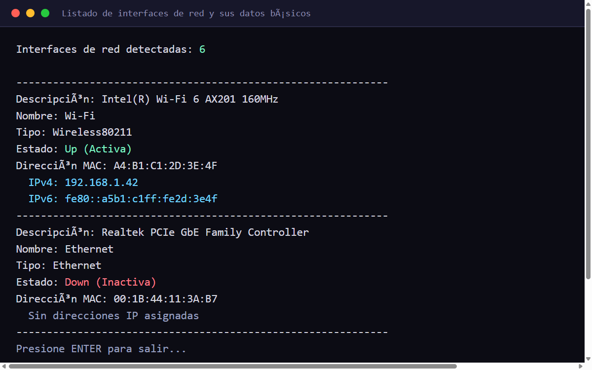

# InterfacesRed — Listado de Interfaces de Red

> **ES:** App de consola (.NET 8, C#) que lista las interfaces de red del equipo con sus datos básicos.
> **EN:** Console app (.NET 8, C#) that lists the machine's network interfaces with their basic data.



---

## Español

### Descripción

Aplicación de consola en **C# (.NET 8)** que detecta y lista las **interfaces de red** del equipo. Para
cada adaptador muestra:

- **Descripción**, **nombre** y **tipo** de la interfaz.
- **Estado** de operación (activa/inactiva, coloreado en consola).
- **Dirección MAC** (formateada `AA:BB:CC:DD:EE:FF`).
- **Direcciones IP** IPv4 e IPv6 (o aviso si no tiene).

### Integrantes (creadores)

- David Antonio López Corella
- Perla Jazmín Márquez Martínez
- Brandon Isaac Miranda Montes
- Natalia Guadalupe Sánchez Valenzuela
- Daniela Sandoval López
- Fei Fei Wu Zhang

**Materia:** Desarrollo de Sistemas III · **Universidad de Sonora**

### Tecnologías

- C# · .NET 8 · `System.Net.NetworkInformation` · `System.Net`

### Ejecutar

```sh
dotnet run --project InterfacesRed
```

O abre `InterfacesRed.sln` en Visual Studio 2022 y ejecuta con **F5**.

### Estructura

- `Program.cs` — punto de entrada.
- `ListadoInterfaces.cs` — obtiene las interfaces (`NetworkInterface.GetAllNetworkInterfaces`) y recorre
  sus propiedades (estado, MAC, IPs).
- `images/` — captura de la salida en consola.

---

## English

### Description

A **C# (.NET 8)** console application that detects and lists the machine's **network interfaces**. For
each adapter it shows:

- The interface **description**, **name**, and **type**.
- **Operational status** (up/down, colour-coded in the console).
- **MAC address** (formatted `AA:BB:CC:DD:EE:FF`).
- **IPv4 and IPv6 addresses** (or a notice when there are none).

### Authors (creators)

- David Antonio López Corella
- Perla Jazmín Márquez Martínez
- Brandon Isaac Miranda Montes
- Natalia Guadalupe Sánchez Valenzuela
- Daniela Sandoval López
- Fei Fei Wu Zhang

**Course:** Software Systems Development III · **University of Sonora**

### Tech

- C# · .NET 8 · `System.Net.NetworkInformation` · `System.Net`

### Run

```sh
dotnet run --project InterfacesRed
```

Or open `InterfacesRed.sln` in Visual Studio 2022 and run with **F5**.

### Structure

- `Program.cs` — entry point.
- `ListadoInterfaces.cs` — gets the interfaces (`NetworkInterface.GetAllNetworkInterfaces`) and walks
  their properties (status, MAC, IPs).
- `images/` — console output screenshot.
